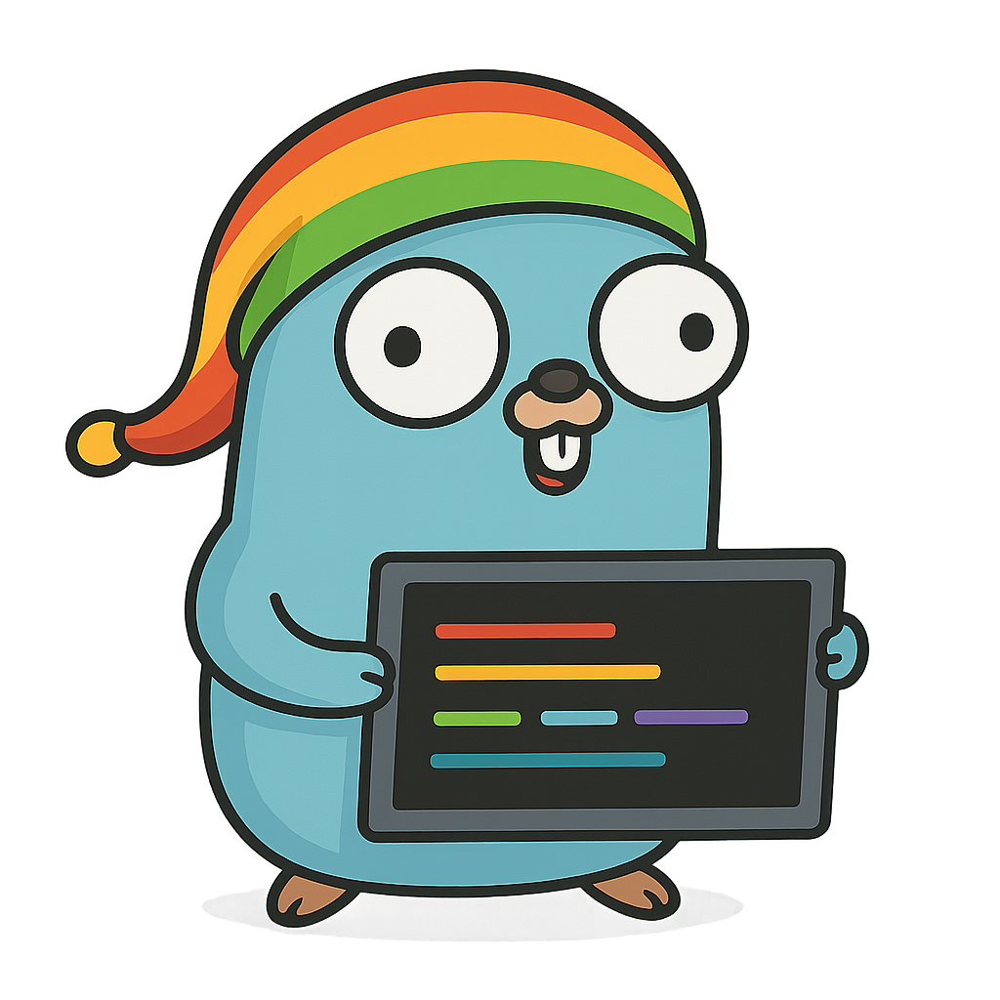

# Rat (Go)
<p align="center">

</p>


I couldn't get BAT to work for me - so I'm creating my own simplified version as a go binary

## 🚀 Features

- Colourful print out of a text file

## 🛠️ Prerequisites

- [Go] To compile the code to a binary

## 📁 Setup

1. Clone this repository:

   ```bash
   git clone https://github.com/jonathon-chew/Rat.git
   cd Rat 
   ```

2. Compile the binary:

    `go build .`

## 📂 Output

Pass in any number of files and the output will pretty print the file

## 🧠 Notes

This is currently a work in progress with a few inovations planned for the future.
Issues will be tracked in Github issues.

### Supported Languages

Rat currently supports syntax highlighting for:
- **Python** (.py) - Keywords, comments, strings, and numbers
- **JavaScript** (.js) - Keywords, comments, strings, and numbers
- **Go** (.go) - Keywords, comments, strings, and numbers
- **PowerShell** (.ps1) - Keywords, comments, strings, variables, and numbers
- **JSON** (.json) - Basic structure highlighting

Performance improvements have been implemented to handle large files efficiently through buffered output and optimized token scanning.

## 📜 License

This project is licensed under the MIT License. See the LICENSE file for details.


### 🖌️ Attribution

The Go Gopher was originally designed by [Renee French](https://reneefrench.blogspot.com/).  
Used under the [Creative Commons Attribution 4.0 License](https://creativecommons.org/licenses/by/4.0/).  
